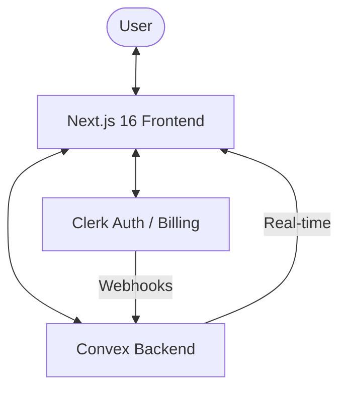

# 🏗️ Application Architecture

## 📐 System Overview

## 🗺️ Codemap
| Directory | Responsibility |
|-----------|----------------|
| `app/` | Frontend routes, layouts, and page components (App Router) |
| `convex/` | Backend schema, API functions (Queries, Mutations, Actions) |
| `components/` | Reusable UI library (shadcn/ui + custom components) |
| `hooks/` | Custom React hooks for data fetching and state |
| `lib/` | Shared utilities, constants, and business logic |
| `public/` | Static assets (images, icons, etc.) |

## 🏛️ Tech Stack
- **Framework**: Next.js 16 (React 19, Turbopack)
- **Database**: Convex (Serverless, Real-time sync)
- **Auth**: Clerk (User management, OIDC)
- **Billing**: Clerk Billing (Subscription management)
- **Styling**: TailwindCSS v4 (Modern utility-first CSS)

## 🔄 Core Architectural Patterns
- **Auth-to-DB Sync**: Users are synced from Clerk to Convex via `/api/clerk-users-webhook`.
- **Real-time State**: Components use `useQuery` hooks for live reactive updates from the database.
- **Protected Access**: Middleware gates `/dashboard` routes, while `<ClerkBillingGate>` handles payment-based access.

---
*Last updated: 2025-12-23*
