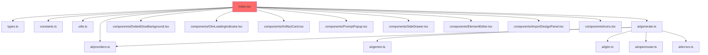

# REFACTORING ANALYSIS REPORT

**Generated**: 27-12-2025 03:01:00
**Target File(s)**: `index.tsx`
**Analyst**: Claude Refactoring Specialist
**Report ID**: refactor_index_27-12-2025_030100

---

## EXECUTIVE SUMMARY

The `index.tsx` file is a **987-line monolithic React component** that violates multiple architectural principles. It contains:
- **25+ state variables** in a single component
- **18+ callback functions** handling disparate concerns
- **0% test coverage** (no test files found)
- **Cyclomatic complexity estimated at 45+** due to nested conditions and async flows

**Recommendation**: HIGH PRIORITY refactoring into modular hooks and sub-components following React 19 patterns and vertical slice architecture.

**Estimated Effort**: 8-12 hours for full refactoring with test coverage establishment.

---

## CODEBASE-WIDE CONTEXT

### Related Files Discovery

| Relationship | File | Lines | Purpose |
|--------------|------|-------|---------|
| **Imports from** | `./types` | 35 | Type definitions (Artifact, Session, LibraryItem, etc.) |
| **Imports from** | `./constants` | 42 | INITIAL_PLACEHOLDERS, GOOGLE_FONTS |
| **Imports from** | `./utils` | 80 | generateId, slugifyName, ImportedDesignData, helpers |
| **Imports from** | `./ai/providers` | 210 | MODELS, getComponentModels, ProviderId, PROVIDER_CONFIG |
| **Imports from** | `./ai/generate` | 290 | generateStyles, stream* functions, cleanCodeFences |
| **Imports from** | `./components/*` | 7 files | UI components (ArtifactCard, SideDrawer, etc.) |

### Dependency Graph



### Additional Refactoring Candidates

| Priority | File | Lines | Reason |
|----------|------|-------|--------|
| CRITICAL | index.tsx | 987 | God component, 25+ state vars, 0% coverage |
| MEDIUM | index.css | 53823 | Massive CSS file, should be modularized |
| LOW | ai/generate.ts | 290 | Well-structured facade, no issues |

### Recommended Approach

- **Refactoring Strategy**: Single-file focus with hook extraction
- **Rationale**: index.tsx is isolated (not imported elsewhere) - safe to refactor
- **Additional files**: Consider CSS modularization as follow-up task

---

## CURRENT STATE ANALYSIS

### File Metrics Summary Table

| Metric | Value | Target | Status |
|--------|-------|--------|--------|
| Total Lines | 987 | <500 | ❌ CRITICAL |
| useState Declarations | 26 | <7 | ❌ CRITICAL |
| useEffect Hooks | 12 | <5 | ❌ HIGH |
| useCallback Hooks | 11 | <5 | ❌ HIGH |
| useRef Hooks | 2 | - | ✅ OK |
| Regular Functions | 13 | <5 | ❌ HIGH |
| Total Functions/Callbacks | 24 | <10 | ❌ CRITICAL |
| Component Count | 1 | 3-5 | ❌ CRITICAL |
| Max Nesting Depth | 6 | <4 | ❌ HIGH |
| JSX Render Block | ~280 lines | <100 | ❌ CRITICAL |

### State Variable Inventory (26 total)

| Category | Variables | Count |
|----------|-----------|-------|
| **Session/Navigation** | sessions, currentSessionIndex, focusedArtifactIndex | 3 |
| **Library** | storedItems, activeSystem | 2 |
| **Settings** | concurrentGenerations, provider, componentModel, designSystemModel | 4 |
| **Input** | inputValue, placeholderIndex, placeholders | 3 |
| **Loading** | isLoading, isReactLoading | 2 |
| **UI Modes** | selectorMode, isDesignSystemMode, snippetTab, copyFeedback, isArtifactFullscreen, isPromptPopupOpen | 6 |
| **Bar State** | barPosition, isBarHidden, areActionsVisible | 3 |
| **Drawer** | drawerState (complex object) | 1 |
| **Variations** | componentVariations | 1 |
| **Element Editor** | editingElement, isElementEditorOpen | 2 |

### Function/Callback Inventory (24 total)

**useCallback Hooks (11):**

| Function | Lines | Complexity | Purpose | Risk |
|----------|-------|------------|---------|------|
| `handleExtractSnippet` | 30 | HIGH | Async stream processing | HIGH |
| `handlePortSnippetToReact` | 25 | HIGH | Async stream processing | HIGH |
| `handleGenerateVariations` | 50 | CRITICAL | JSON streaming parser | CRITICAL |
| `handlePortToReact` | 25 | MEDIUM | Async stream | MEDIUM |
| `handleDownload` | 20 | LOW | File download | LOW |
| `copyToClipboard` | 25 | LOW | Clipboard API | LOW |
| `handleImportDesign` | 20 | MEDIUM | Session creation | MEDIUM |
| `applyElementChanges` | 25 | MEDIUM | iframe messaging | MEDIUM |
| `saveElementEdits` | 30 | MEDIUM | Extract HTML from iframe | MEDIUM |
| `handleInputChange` | 10 | LOW | Input handler | LOW |
| `handleSendMessage` | 80 | CRITICAL | Main generation logic | CRITICAL |

**Regular Functions (13):**

| Function | Lines | Purpose | Risk |
|----------|-------|---------|------|
| `handleIframeMessage` | 15 | Message event handler | MEDIUM |
| `applyVariation` | 12 | Apply variation to artifact | LOW |
| `handleShowCode` | 10 | Open code drawer | LOW |
| `handleShowAgentPrompt` | 12 | Open agent prompt drawer | LOW |
| `handleSaveToLibrary` | 15 | Save to library | LOW |
| `handleShowLibrary` | 7 | Open library drawer | LOW |
| `handleShowImport` | 7 | Open import drawer | LOW |
| `toggleSystemContext` | 10 | Toggle design system context | LOW |
| `deleteFromLibrary` | 5 | Delete library item | LOW |
| `loadFromLibrary` | 20 | Load item from library | LOW |
| `generateArtifact` | 30 | Nested async in handleSendMessage | HIGH |
| `handleSurpriseMe` | 5 | Trigger random prompt | LOW |
| `nextItem` / `prevItem` | 10 | Navigation functions | LOW |

### Code Smell Analysis

| Code Smell | Count | Severity | Examples |
|------------|-------|----------|----------|
| God Component | 1 | CRITICAL | App() - 987 lines, 26 state vars, 24 functions |
| Long Methods | 3 | HIGH | handleSendMessage (80 lines), handleGenerateVariations (50 lines) |
| Feature Envy | 5 | MEDIUM | Functions accessing drawerState, sessions heavily |
| Primitive Obsession | 4 | MEDIUM | barPosition as string, selectorMode as union |
| Too Many Parameters | 2 | LOW | State variables passed implicitly via closure |
| Duplicate Patterns | 6 | MEDIUM | Stream processing loops repeated across 5 functions |
| Missing Abstraction | 4 | HIGH | Session management, drawer management, settings persistence not abstracted |
| Nested Function Definition | 1 | MEDIUM | generateArtifact defined inside handleSendMessage |
| Excessive Hooks | 1 | CRITICAL | 12 useEffect + 11 useCallback = 23 hooks in single component |

### Test Coverage Analysis

| File/Module | Coverage | Status |
|-------------|----------|--------|
| index.tsx | 0% | ❌ NO TESTS |
| All project files | 0% | ❌ NO TEST FRAMEWORK |

**Test Discovery Result**: Only `skills/exa-research/test_skill.py` found (unrelated Python test).

**Coverage Gaps**:
- No test runner configured (no jest, vitest, or testing-library)
- No test files for any TypeScript/React components
- Critical paths completely untested

---

## COMPLEXITY ANALYSIS

### Detailed Complexity Metrics

| Function/Block | Physical Lines | Logical Lines | Cyclomatic | Cognitive | Nesting | Risk |
|----------------|----------------|---------------|------------|-----------|---------|------|
| App() | 987 | 700+ | 45+ | 80+ | 6 | CRITICAL |
| handleSendMessage | 80 | 60 | 12 | 35 | 4 | CRITICAL |
| handleGenerateVariations | 45 | 40 | 10 | 28 | 5 | HIGH |
| handleExtractSnippet | 30 | 25 | 6 | 18 | 3 | MEDIUM |
| JSX render block | 200+ | 150+ | 15+ | 40+ | 6 | CRITICAL |

### Cyclomatic Complexity Breakdown (handleSendMessage)

```
Decision Points:
1. if (!trimmedInput || isLoading) return  → +1
2. if (!manualPrompt)                      → +1
3. isDesignSystemMode ternary              → +1
4. activeSystem conditional                → +2
5. for await loop                          → +1
6. try/catch/finally                       → +2
7. Promise.all with map                    → +1
8. Nested async function                   → +2
9. Total: 12 cyclomatic complexity
```

### Nesting Depth Analysis

```
Level 0: App function
  Level 1: useCallback/useEffect
    Level 2: try/catch
      Level 3: for await loop
        Level 4: setSessions callback
          Level 5: .map() callback
            Level 6: ternary/conditional
```

**Maximum Nesting**: 6 levels (exceeds recommended 4)

---

## REFACTORING STRATEGY

### Target Architecture

```
src/
├── index.tsx                    # App shell only (~50 lines)
├── hooks/
│   ├── useSessionManager.ts     # Session CRUD operations
│   ├── useLibrary.ts            # Library storage and context
│   ├── useDrawer.ts             # Drawer state management
│   ├── useSettings.ts           # Provider, model, preferences
│   ├── useElementEditor.ts      # Element editing state
│   └── useArtifactGeneration.ts # AI generation orchestration
├── components/
│   ├── AppShell.tsx             # Layout wrapper
│   ├── EmptyState.tsx           # Welcome screen
│   ├── SessionGrid.tsx          # Session/artifact grid
│   ├── ActionBar.tsx            # Bottom action bar
│   ├── FloatingInput.tsx        # Prompt input bar
│   └── ... (existing components)
└── utils/
    └── streamHelpers.ts         # Shared streaming utilities
```

### Extraction Plan (Priority Order)

#### Phase 1: Hook Extractions (Lowest Risk)

**1.1 Extract `useSettings` Hook**
- **Source**: Lines 70-95, 140-175
- **State**: provider, componentModel, designSystemModel, concurrentGenerations, barPosition, isBarHidden
- **Effects**: localStorage sync effects
- **Risk**: LOW
- **Estimated Time**: 1 hour

**Before**:
```typescript
const [provider, setProvider] = useState<ProviderId>(() => {
    const saved = localStorage.getItem('flash_ui_provider');
    if (saved === 'gemini' || saved === 'glm' || saved === 'openrouter') {
        return saved;
    }
    return 'gemini';
});
// ... 6 more state declarations
// ... 6 useEffect hooks for localStorage
```

**After**:
```typescript
// hooks/useSettings.ts
export function useSettings() {
    const [provider, setProvider] = useState<ProviderId>(() => {
        const saved = localStorage.getItem('flash_ui_provider');
        return isValidProvider(saved) ? saved : 'gemini';
    });
    // ... consolidated state and effects
    return { provider, setProvider, componentModel, ... };
}

// index.tsx
const settings = useSettings();
```

**1.2 Extract `useDrawer` Hook**
- **Source**: Lines 110-120, drawer-related callbacks
- **State**: drawerState, componentVariations, snippetTab, copyFeedback
- **Functions**: handleShowCode, handleShowAgentPrompt, handleShowLibrary, handleShowImport, applyVariation
- **Risk**: LOW
- **Estimated Time**: 1.5 hours

**1.3 Extract `useSessionManager` Hook**
- **Source**: Lines 60-65, session-related callbacks
- **State**: sessions, currentSessionIndex, focusedArtifactIndex
- **Functions**: nextItem, prevItem, navigation logic
- **Risk**: MEDIUM (core data)
- **Estimated Time**: 2 hours

**1.4 Extract `useLibrary` Hook**
- **Source**: Lines 65-70, library callbacks
- **State**: storedItems, activeSystem
- **Functions**: handleSaveToLibrary, deleteFromLibrary, loadFromLibrary, toggleSystemContext
- **Risk**: LOW
- **Estimated Time**: 1 hour

**1.5 Extract `useArtifactGeneration` Hook**
- **Source**: Lines 190-350 (generation callbacks)
- **Functions**: handleSendMessage, handleGenerateVariations, handlePortToReact, handleExtractSnippet
- **Dependencies**: provider, models, sessions
- **Risk**: HIGH (core functionality)
- **Estimated Time**: 2.5 hours

#### Phase 2: Component Extractions

**2.1 Extract `EmptyState` Component**
- **Source**: Lines 555-570
- **Props**: isDesignSystemMode, onToggleMode, onSurpriseMe, isLoading
- **Risk**: LOW
- **Estimated Time**: 30 mins

**2.2 Extract `ActionBar` Component**
- **Source**: Lines 595-630
- **Props**: All action handlers, selectorMode, isLoading, focusedArtifactIndex
- **Risk**: LOW
- **Estimated Time**: 1 hour

**2.3 Extract `FloatingInput` Component**
- **Source**: Lines 640-750
- **Props**: settings, isLoading, onShowLibrary, onShowImport
- **Risk**: MEDIUM
- **Estimated Time**: 1.5 hours

**2.4 Extract `SessionGrid` Component**
- **Source**: Lines 575-595
- **Props**: sessions, currentSessionIndex, focusedArtifactIndex, selectorMode
- **Risk**: LOW
- **Estimated Time**: 1 hour

#### Phase 3: Utility Extractions

**3.1 Extract Stream Processing Utilities**
- **Source**: handleGenerateVariations JSON parsing, stream accumulation patterns
- **Target**: utils/streamHelpers.ts
- **Risk**: LOW
- **Estimated Time**: 1 hour

---

## RISK ASSESSMENT

### Risk Matrix

| Risk | Likelihood | Impact | Score | Mitigation |
|------|------------|--------|-------|------------|
| Breaking functionality | HIGH | CRITICAL | 9 | Tests required before refactoring |
| State synchronization bugs | HIGH | HIGH | 8 | Incremental extraction, test each hook |
| Performance regression | LOW | MEDIUM | 3 | Benchmark before/after |
| API contract changes | LOW | LOW | 2 | Keep callback signatures identical |
| Missing edge cases | HIGH | HIGH | 8 | Manual testing checklist |

### Technical Risks

1. **No Test Coverage (CRITICAL)**
   - Mitigation: Establish test baseline BEFORE any refactoring
   - Required: Install vitest, @testing-library/react
   - Target: 80% coverage on critical paths

2. **Complex State Interdependencies**
   - Mitigation: Map all state dependencies before extraction
   - Use React DevTools to trace state updates

3. **Async Stream Processing**
   - Mitigation: Create integration tests for AI generation flows
   - Fallback: Keep original implementation as backup

### Rollback Strategy

1. Create feature branch: `git checkout -b refactor/index-hooks`
2. Backup original: `cp index.tsx backup_temp/index_original.tsx`
3. Commit after each successful extraction
4. Tag stable points: `git tag refactor-phase-1-complete`
5. If critical failure: `git checkout main -- index.tsx`

---

## IMPLEMENTATION CHECKLIST

### Pre-Refactoring Tasks (CRITICAL)

```json
[
  {"id": "1", "content": "Install test dependencies: npm install -D vitest @testing-library/react @testing-library/user-event jsdom", "priority": "critical"},
  {"id": "2", "content": "Create backup: cp index.tsx backup_temp/index_original_27-12-2025.tsx", "priority": "critical"},
  {"id": "3", "content": "Create feature branch: git checkout -b refactor/index-modularization", "priority": "critical"},
  {"id": "4", "content": "Write smoke tests for handleSendMessage flow", "priority": "high"},
  {"id": "5", "content": "Write smoke tests for library operations", "priority": "high"},
  {"id": "6", "content": "Write smoke tests for drawer state transitions", "priority": "high"}
]
```

### Phase 1: Hook Extraction Tasks

```json
[
  {"id": "7", "content": "Create hooks/ directory", "priority": "high"},
  {"id": "8", "content": "Extract useSettings hook with localStorage sync", "priority": "high"},
  {"id": "9", "content": "Test useSettings hook isolation", "priority": "high"},
  {"id": "10", "content": "Extract useDrawer hook with all drawer callbacks", "priority": "high"},
  {"id": "11", "content": "Test useDrawer hook isolation", "priority": "high"},
  {"id": "12", "content": "Extract useLibrary hook with storage operations", "priority": "high"},
  {"id": "13", "content": "Test useLibrary hook isolation", "priority": "high"},
  {"id": "14", "content": "Extract useSessionManager hook", "priority": "high"},
  {"id": "15", "content": "Test useSessionManager hook isolation", "priority": "high"},
  {"id": "16", "content": "Extract useArtifactGeneration hook (most complex)", "priority": "high"},
  {"id": "17", "content": "Test useArtifactGeneration with mock AI responses", "priority": "high"},
  {"id": "18", "content": "Validate all tests pass after Phase 1", "priority": "critical"}
]
```

### Phase 2: Component Extraction Tasks

```json
[
  {"id": "19", "content": "Extract EmptyState component", "priority": "medium"},
  {"id": "20", "content": "Extract ActionBar component", "priority": "medium"},
  {"id": "21", "content": "Extract FloatingInput component", "priority": "medium"},
  {"id": "22", "content": "Extract SessionGrid component", "priority": "medium"},
  {"id": "23", "content": "Update index.tsx to use new components", "priority": "medium"},
  {"id": "24", "content": "Validate all tests pass after Phase 2", "priority": "critical"}
]
```

### Post-Refactoring Tasks

```json
[
  {"id": "25", "content": "Run full manual testing of all features", "priority": "critical"},
  {"id": "26", "content": "Verify localStorage persistence works", "priority": "high"},
  {"id": "27", "content": "Verify AI generation flows work end-to-end", "priority": "critical"},
  {"id": "28", "content": "Update REPO_MAP.md with new file structure", "priority": "medium"},
  {"id": "29", "content": "Create PR with detailed change description", "priority": "medium"},
  {"id": "30", "content": "Delete backup_temp files after merge", "priority": "low"}
]
```

---

## TIMELINE ESTIMATION

| Phase | Tasks | Estimated Hours | Dependencies |
|-------|-------|-----------------|--------------|
| Setup & Tests | Install deps, write smoke tests | 3-4 hours | None |
| Phase 1 | Hook extractions (5 hooks) | 6-8 hours | Setup complete |
| Phase 2 | Component extractions (4 components) | 3-4 hours | Phase 1 complete |
| Validation | Full testing, documentation | 2 hours | All phases |
| **Total** | | **14-18 hours** | |

---

## SUCCESS METRICS

### Before Refactoring

| Metric | Current Value |
|--------|---------------|
| Lines in index.tsx | 987 |
| useState declarations | 26 |
| useEffect hooks | 12 |
| useCallback hooks | 11 |
| Regular functions | 13 |
| Total functions/callbacks | 24 |
| Test coverage | 0% |
| Max file size | 987 lines |

### After Refactoring (Targets)

| Metric | Target Value | Validation |
|--------|--------------|------------|
| Lines in index.tsx | <100 | Line count |
| State variables in App | 0 (all in hooks) | Code review |
| Functions in App | <3 | Code review |
| Test coverage | >80% | vitest --coverage |
| Max file size | <300 lines | All files |
| Hooks created | 5-6 | File count |
| Components created | 4 | File count |

### Checklist

- [ ] All tests passing after each extraction
- [ ] Code coverage ≥ 80%
- [ ] No performance degradation (render time)
- [ ] Cyclomatic complexity < 15 per function
- [ ] File sizes < 300 lines
- [ ] localStorage persistence verified
- [ ] AI generation flows verified
- [ ] Backup files created and verified

---

## APPENDICES

### A. Complete State Dependency Map

```
sessions ← handleSendMessage, handleImportDesign, loadFromLibrary, applyVariation
         ← saveElementEdits, handleExtractSnippet, handleGenerateVariations
         
currentSessionIndex ← handleSendMessage, handleImportDesign, loadFromLibrary
                    ← nextItem, prevItem, focusedArtifactIndex effects
                    
focusedArtifactIndex ← handleExtractSnippet, handleGenerateVariations
                     ← handlePortToReact, saveElementEdits, action bar
                     
provider ← generateStyles, streamHtmlArtifact (all AI operations)
         ← availableModels derived state
         
drawerState ← handleShowCode, handleShowAgentPrompt, handleShowLibrary
            ← handleShowImport, applyVariation, copyToClipboard
            ← handleExtractSnippet, handlePortSnippetToReact
```

### B. Test Strategy Recommendations

**Unit Tests (Hooks)**:
```typescript
// Example: useSettings.test.ts
describe('useSettings', () => {
  it('loads provider from localStorage', () => {...});
  it('persists provider changes to localStorage', () => {...});
  it('resets model selections when provider changes', () => {...});
  it('validates provider values', () => {...});
});
```

**Integration Tests (Components)**:
```typescript
// Example: App.test.tsx
describe('App', () => {
  it('renders empty state initially', () => {...});
  it('generates artifacts on prompt submission', () => {...});
  it('navigates between sessions', () => {...});
  it('saves artifacts to library', () => {...});
});
```

### C. File Size After Refactoring (Projected)

| File | Projected Lines |
|------|-----------------|
| index.tsx | 80-100 |
| hooks/useSettings.ts | 80-100 |
| hooks/useDrawer.ts | 100-120 |
| hooks/useSessionManager.ts | 100-120 |
| hooks/useLibrary.ts | 80-100 |
| hooks/useArtifactGeneration.ts | 150-200 |
| components/EmptyState.tsx | 40-50 |
| components/ActionBar.tsx | 80-100 |
| components/FloatingInput.tsx | 120-150 |
| components/SessionGrid.tsx | 60-80 |

---

*This report serves as a comprehensive guide for refactoring execution.*
*Reference: @reports/refactor/refactor_index_27-12-2025_030100.md*

**⚠️ REMINDER: This is ANALYSIS ONLY. No code modifications were made.**
