# REFACTORING ANALYSIS REPORT
**Generated**: 29-12-2025 16:39:47  
**Target File(s)**: index.tsx  
**Analyst**: Claude Refactoring Specialist  
**Report ID**: refactor_index_tsx_29-12-2025_163940

## EXECUTIVE SUMMARY
- `index.tsx` is a 988-line entrypoint; `App` spans 913 lines and carries cyclomatic 203 and cognitive 225.
- The file blends state management, AI streaming, DOM/iframe operations, and UI rendering in one function.
- 27 `useState` hooks, 12 `useEffect` hooks, 11 `useCallback` hooks, and 2 `useRef` hooks indicate heavy local orchestration.
- There is no app test suite or coverage tooling; refactoring needs a safety net plan before execution.
- Recommended strategy: keep `index.tsx` as a thin shell and extract domain hooks/services plus presentational subcomponents.

## CODEBASE-WIDE CONTEXT
<thinking>Phase 0 executed to gauge coupling and adjacent large files.</thinking>

### Related Files Discovery
- Target file imported by: 0 files (entrypoint referenced from `index.html`).
- Target file imports: 15 modules (2 external, 13 internal).
- Tightly coupled modules: `ai/generate.ts`, `ai/providers.ts`, `components/*`, `utils.ts`, `types.ts`.
- Circular dependencies detected: none observed in current map.

### Additional Refactoring Candidates
| Priority | File | Lines | Reason | Relationship to Target |
|----------|------|-------|--------|------------------------|
| HIGH | index.css | 2358 | Monolithic stylesheet; classnames intertwined with UI | Direct styling dependency |
| MEDIUM | components/ElementEditor.tsx | 559 | Large UI subfeature | Referenced from index.tsx |
| MEDIUM | ai/generate.ts | 332 | Streaming orchestration | Called by generation handlers |
| LOW | server/proxy.ts | 403 | Separate runtime | Out of scope |

### Recommended Approach
- Refactoring Strategy: single-file focus with extracted hooks/services and UI subcomponents.
- Rationale: `index.tsx` is an entrypoint with heavy internal coupling; modularizing it reduces risk while keeping external APIs stable.
- Additional files to include: new files extracted from `index.tsx` only, unless follow-on work is approved.

## CURRENT STATE ANALYSIS
<thinking>Focus on file-level metrics and responsibility distribution.</thinking>

### File Metrics Summary Table
| Metric | Value | Target | Status |
|--------|-------|--------|--------|
| Total Lines | 988 | < 500 | OVER |
| Logical Lines | 864 | < 400 | OVER |
| Named Functions | 28 | < 20 | OVER |
| useState Hooks | 27 | < 10 | OVER |
| useEffect Hooks | 12 | < 6 | OVER |
| useCallback Hooks | 11 | < 6 | OVER |
| Imports | 15 | < 8 | OVER |

### Code Smell Analysis
| Code Smell | Count | Severity | Examples |
|------------|-------|----------|----------|
| God Function | 1 | CRITICAL | `App` (913 lines) |
| Long Functions (> 60 lines) | 2 | HIGH | `App`, `handleSendMessage` |
| High Complexity | 3 | HIGH | `App`, `handleSendMessage`, `handleGenerateVariations` |
| Excessive Hooks | 1 | HIGH | 27 `useState` + 12 `useEffect` |
| Direct DOM/Browser APIs | 5+ | MEDIUM | `document`, `window`, `navigator`, `localStorage` |
| Manual Stream Parsing | 1 | MEDIUM | JSON buffer parsing in `handleGenerateVariations` |

### Responsibility Distribution (Current)
- Session management: session creation, focus, navigation.
- AI generation: styles, HTML streaming, snippet extraction, React conversion.
- Library persistence: localStorage, library CRUD, active system context.
- Element editor: iframe postMessage, HTML extraction.
- UI layout and action bar rendering.

## TEST COVERAGE ANALYSIS
<thinking>Evaluate current safety net and test scaffolding.</thinking>

### Test Discovery
- Test files found: `skills/exa-research/test_skill.py` (unrelated to app).
- `package.json` contains no `test` or `coverage` script.
- No JS/TS test framework appears in dependencies.

### Coverage Mapping
| Source File/Module | Test Files | Coverage | Notes |
|--------------------|-----------|----------|-------|
| index.tsx | none | 0% | No test runner configured |
| components/* | none | 0% | No component tests present |
| ai/* | none | 0% | No unit/integration tests present |

### Safety Net Requirements (For Execution Planning)
- Target coverage: 80-90% for extracted hooks/services.
- Critical path coverage: 100% for AI generation flow and library persistence.
- Suggested tools: Vitest + @testing-library/react + jsdom.
- Environment: npm (Vite-based app), no existing test setup.

## COMPLEXITY ANALYSIS
<thinking>Exact cyclomatic via AST; cognitive complexity computed with nesting-weighted decisions.</thinking>

### Method Summary
- Cyclomatic complexity: counted via TypeScript AST decision points (if/loop/case/ternary/logical operators).
- Cognitive complexity: nesting-weighted decision metric (Sonar-inspired, documented in Appendix A).
- Logical lines: non-empty, non-comment lines (block comments stripped).

### Function-Level Metrics
| Function/Class | Lines | Cyclomatic | Cognitive | Parameters | Nesting | Risk |
|----------------|-------|------------|-----------|------------|---------|------|
| App | 913 | 203 | 225 | 0 | 5 | CRITICAL |
| availableModels | 1 | 1 | 0 | 1 | 0 | LOW |
| handleIframeMessage | 15 | 5 | 5 | 1 | 3 | LOW |
| handleExtractSnippet | 29 | 5 | 3 | 2 | 1 | LOW |
| handlePortSnippetToReact | 23 | 5 | 3 | 0 | 1 | LOW |
| handleGenerateVariations | 52 | 14 | 30 | 0 | 5 | CRITICAL |
| handlePortToReact | 25 | 4 | 2 | 0 | 1 | LOW |
| handleDownload | 22 | 9 | 10 | 1 | 2 | MEDIUM |
| copyToClipboard | 23 | 5 | 3 | 1 | 1 | LOW |
| applyVariation | 12 | 4 | 4 | 1 | 2 | LOW |
| handleShowCode | 13 | 4 | 2 | 0 | 1 | LOW |
| handleShowAgentPrompt | 13 | 5 | 3 | 0 | 1 | LOW |
| handleSaveToLibrary | 16 | 6 | 6 | 0 | 2 | LOW |
| handleShowLibrary | 8 | 1 | 0 | 0 | 0 | LOW |
| handleShowImport | 8 | 1 | 0 | 0 | 0 | LOW |
| handleImportDesign | 18 | 1 | 0 | 3 | 0 | LOW |
| toggleSystemContext | 10 | 2 | 1 | 2 | 1 | LOW |
| deleteFromLibrary | 5 | 2 | 1 | 2 | 1 | LOW |
| loadFromLibrary | 22 | 1 | 0 | 1 | 0 | LOW |
| applyElementChanges | 22 | 5 | 4 | 1 | 1 | LOW |
| saveElementEdits | 28 | 7 | 6 | 0 | 2 | LOW |
| handleInputChange | 8 | 3 | 1 | 1 | 1 | LOW |
| handleSendMessage | 80 | 18 | 22 | 1 | 3 | CRITICAL |
| placeholderArtifacts | 7 | 1 | 0 | 2 | 0 | LOW |
| generateArtifact | 26 | 9 | 13 | 2 | 3 | MEDIUM |
| handleSurpriseMe | 5 | 1 | 0 | 0 | 0 | LOW |
| nextItem | 5 | 5 | 3 | 0 | 2 | LOW |
| prevItem | 4 | 4 | 2 | 0 | 2 | LOW |

### File-Level Metrics
- Halstead volume: 38022.90
- Halstead difficulty: 97.51
- Maintainability Index: 0 (MI formula applied with logical LOC and cyclomatic from `App`)

## DEPENDENCY ANALYSIS
<thinking>Map internal and external dependencies plus hidden global usage.</thinking>

### Direct Imports (index.tsx)
- External: `react`, `react-dom/client`
- Internal: `./types`, `./constants`, `./utils`, `./ai/providers`, `./ai/generate`, `./components/*`

### Dependency Graph

```mermaid
graph TD
  A[index.tsx] --> B[types.ts]
  A --> C[constants.ts]
  A --> D[utils.ts]
  A --> E[ai/providers.ts]
  A --> F[ai/generate.ts]
  A --> G[components/DottedGlowBackground.tsx]
  A --> H[components/GlmLoadingIndicator.tsx]
  A --> I[components/ArtifactCard.tsx]
  A --> J[components/PromptPopup.tsx]
  A --> K[components/SideDrawer.tsx]
  A --> L[components/ElementEditor.tsx]
  A --> M[components/ImportDesignPanel.tsx]
  A --> N[components/Icons.tsx]
  A --> R[react]
  A --> RD[react-dom/client]
```


### Coupling Metrics
| Module | Imports From | Imported By | Afferent (Ca) | Efferent (Ce) | Instability |
|--------|-------------|-------------|---------------|---------------|-------------|
| index.tsx | 15 modules | 0 modules | 0 | 15 | 1.00 |

### Hidden Dependencies / Globals
- `localStorage` (preferences, library persistence)
- `window` (message listener, secure context)
- `document` (download creation, clipboard fallback, iframe access)
- `navigator.clipboard` (clipboard API)

## PERFORMANCE BASELINES
<thinking>Baseline metrics are planned, not measured in this analysis.</thinking>

| Metric | Current | Target | Notes |
|--------|---------|--------|-------|
| Import Time | Unmeasured | < 0.5s | Use `performance.now()` around import |
| Memory Usage | Unmeasured | Lower | Use `performance.memory` or DevTools |
| Stream Latency | Unmeasured | Stable | Benchmark stream start and completion |
| Test Runtime | Unmeasured | < 5s | Requires test runner setup |

## REFACTORING STRATEGY
<thinking>Favor incremental extraction into hooks and UI components.</thinking>

### Target Architecture
Proposed (top-level, preserving current root layout):
```
hooks/
  useSessionManager.ts
  useLibrary.ts
  useDrawer.ts
  useArtifactGeneration.ts
  useVariations.ts
  useSnippetConversion.ts
  useElementEditor.ts
  usePreferences.ts
components/
  AppShell.tsx
  ActionBar.tsx
  SessionGrid.tsx
  EmptyState.tsx
  ... (existing components)
services/
  streamParsers.ts
  clipboard.ts
```

### Extraction Strategy (40-60 line blocks)
1. Extract AI generation pipeline (styles + streaming HTML) into `useArtifactGeneration`.
2. Extract variation streaming + JSON buffer parsing into `useVariations` and `streamParsers.ts`.
3. Extract library persistence and context toggling into `useLibrary`.
4. Extract iframe element editing into `useElementEditor`.
5. Extract drawer management into `useDrawer`.
6. Extract prompt bar behavior into `ActionBar` and `usePreferences`.

### Example Extractions (Before/After)

#### Extraction 1: Artifact Generation Pipeline
**BEFORE (index.tsx)**:
```ts
const handleSendMessage = useCallback(async (manualPrompt?: string) => {
  const promptToUse = manualPrompt || inputValue;
  const trimmedInput = promptToUse.trim();
  if (!trimmedInput || isLoading) return;
  if (!manualPrompt) setInputValue('');

  setIsLoading(true);
  const sessionId = generateId();
  const placeholderArtifacts: Artifact[] = Array(concurrentGenerations).fill(null).map((_, i) => ({
    id: `${sessionId}_${i}`,
    styleName: 'Designing...',
    html: '',
    status: 'streaming',
    isDesignSystem: isDesignSystemMode
  }));
  // ... generateStyles, streamHtmlArtifact, setSessions updates ...
}, [inputValue, isLoading, sessions.length, isDesignSystemMode, activeSystem, concurrentGenerations, designSystemModel, componentModel, provider]);
```

**AFTER (planned)**:
```ts
const { sendPrompt, isGenerating } = useArtifactGeneration({
  provider,
  componentModel,
  designSystemModel,
  isDesignSystemMode,
  activeSystem
});

const handleSendMessage = useCallback(async (manualPrompt?: string) => {
  const promptToUse = manualPrompt || inputValue;
  const trimmed = promptToUse.trim();
  if (!trimmed || isGenerating) return;
  if (!manualPrompt) setInputValue('');
  await sendPrompt({
    prompt: trimmed,
    concurrency: concurrentGenerations,
    onSessionCreated: session => setSessions(prev => [...prev, session]),
    onSessionUpdated: updater => setSessions(updater)
  });
}, [inputValue, isGenerating, concurrentGenerations, sendPrompt]);
```

**Migration Steps**
1. Create `useArtifactGeneration` with current streaming logic.
2. Move placeholder creation and session updates into hook callbacks.
3. Replace `handleSendMessage` body with hook call.
4. Verify: generated styles and streaming HTML remain identical.

#### Extraction 2: Variations Stream Parsing
**BEFORE (index.tsx)**:
```ts
const handleGenerateVariations = useCallback(async () => {
  const currentSession = sessions[currentSessionIndex];
  if (!currentSession || focusedArtifactIndex === null) return;
  const currentArtifact = currentSession.artifacts[focusedArtifactIndex];
  setIsLoading(true);
  setComponentVariations([]);
  setDrawerState({ isOpen: true, mode: 'variations', title: 'Variations', data: currentArtifact.id });
  try {
    const stream = streamVariations({ provider, prompt: currentSession.prompt });
    let buffer = '';
    for await (const chunk of stream) {
      buffer += chunk;
      let braceCount = 0;
      let start = buffer.indexOf('{');
      while (start !== -1) {
        // parse JSON objects from buffer
      }
    }
  } finally {
    setIsLoading(false);
  }
}, [sessions, currentSessionIndex, focusedArtifactIndex, provider]);
```

**AFTER (planned)**:
```ts
const { generateVariations } = useVariations({ provider });

const handleGenerateVariations = useCallback(async () => {
  const currentSession = sessions[currentSessionIndex];
  if (!currentSession || focusedArtifactIndex === null) return;
  const currentArtifact = currentSession.artifacts[focusedArtifactIndex];
  setIsLoading(true);
  setComponentVariations([]);
  setDrawerState({ isOpen: true, mode: 'variations', title: 'Variations', data: currentArtifact.id });
  try {
    await generateVariations(currentSession.prompt, variation => {
      setComponentVariations(prev => [...prev, variation]);
    });
  } finally {
    setIsLoading(false);
  }
}, [sessions, currentSessionIndex, focusedArtifactIndex, generateVariations]);
```

**Migration Steps**
1. Implement `streamParsers.ts` with the JSON-buffer parser.
2. Create `useVariations` that wraps `streamVariations`.
3. Replace inline parser with `generateVariations`.

#### Extraction 3: Element Editor Iframe Updates
**BEFORE (index.tsx)**:
```ts
const applyElementChanges = useCallback((changes) => {
  if (!editingElement) return;
  const iframes = document.querySelectorAll('.artifact-card.focused iframe');
  if (iframes.length === 0) return;
  const iframe = iframes[0] as HTMLIFrameElement;
  if (!iframe.contentWindow) return;
  const { textContent, href, ...styles } = changes;
  iframe.contentWindow.postMessage({
    type: 'APPLY_STYLE',
    path: editingElement.path,
    styles: Object.keys(styles).length > 0 ? styles : undefined,
    textContent,
    href
  }, '*');
}, [editingElement]);
```

**AFTER (planned)**:
```ts
const { applyChanges, saveEdits } = useElementEditor({
  editingElement,
  focusedArtifactIndex,
  currentSessionIndex,
  setSessions
});

const applyElementChanges = useCallback((changes) => {
  applyChanges(changes);
}, [applyChanges]);
```

**Migration Steps**
1. Extract iframe lookup and message send into `useElementEditor`.
2. Centralize iframe querying and null checks.
3. Keep `ElementEditor` component API unchanged.

## RISK ASSESSMENT
<thinking>Assess technical and project risks plus mitigations.</thinking>

### Risk Matrix
| Risk | Likelihood | Impact | Score | Mitigation |
|------|------------|--------|-------|------------|
| Regression in AI streaming flow | Medium | High | 6 | Add integration tests; extract with feature-flag toggle |
| LocalStorage behavior drift | Medium | Medium | 4 | Snapshot tests for persisted values |
| Element editor iframe regressions | Low | High | 3 | Focused tests around postMessage and HTML extraction |
| UX regressions in action bar | Medium | Medium | 4 | Component tests for action bar rendering |
| Hidden DOM dependencies | Medium | Medium | 4 | Centralize DOM access in hooks |

### Rollback Plan
1. Branch protection and incremental PRs.
2. Backup original files in `backup_temp/`.
3. Tag refactor checkpoints per extraction phase.
4. Revert hook extraction individually if regressions appear.

## EXECUTION PLANNING (ANALYSIS ONLY)
<thinking>Define a safe incremental plan with verification points.</thinking>

### Phase 0: Backups
- Create `backup_temp/` and copy `index.tsx` with timestamp.

### Phase 1: Safety Net
- Add test runner (Vitest + testing-library).
- Create smoke tests for: generation flow, library CRUD, drawer transitions, element edit apply/save.

### Phase 2: Extraction Steps
1. Extract `usePreferences` (localStorage for provider/model/bar position).
2. Extract `useLibrary` (storedItems, activeSystem, CRUD handlers).
3. Extract `useDrawer` (drawerState + open/close handlers).
4. Extract `useVariations` + `streamParsers.ts`.
5. Extract `useArtifactGeneration` for main streaming flow.
6. Extract `useElementEditor` for iframe editing.
7. Introduce `AppShell`, `ActionBar`, `SessionGrid`, `EmptyState`.
8. Remove unused state/handlers from `index.tsx`.

### Task Breakdown (TodoWrite Compatible)
```json
[
  { "id": "backup_index", "content": "Create backup of index.tsx in backup_temp/", "priority": "critical", "estimated_hours": 0.5 },
  { "id": "test_setup", "content": "Add Vitest + testing-library scaffolding", "priority": "high", "estimated_hours": 4 },
  { "id": "test_generation", "content": "Add smoke tests for handleSendMessage pipeline", "priority": "high", "estimated_hours": 6 },
  { "id": "extract_preferences", "content": "Extract localStorage preferences to usePreferences hook", "priority": "high", "estimated_hours": 2 },
  { "id": "extract_library", "content": "Extract library CRUD to useLibrary hook", "priority": "high", "estimated_hours": 3 },
  { "id": "extract_variations", "content": "Move variation streaming + parser to useVariations", "priority": "high", "estimated_hours": 4 },
  { "id": "extract_generation", "content": "Move artifact generation to useArtifactGeneration", "priority": "high", "estimated_hours": 6 },
  { "id": "extract_element_editor", "content": "Move iframe editing to useElementEditor", "priority": "medium", "estimated_hours": 3 },
  { "id": "ui_shell", "content": "Extract AppShell/ActionBar/SessionGrid", "priority": "medium", "estimated_hours": 4 },
  { "id": "verify", "content": "Run full test suite after each extraction", "priority": "high", "estimated_hours": 2 }
]
```

### Timeline Estimate
- Safety net: 1-2 days
- Extraction phase: 3-5 days
- Validation and cleanup: 1 day

## SUCCESS METRICS
- Cyclomatic complexity per function < 15.
- `index.tsx` reduced to < 300 lines.
- Hook modules capped at 150-250 lines each.
- Test coverage for extracted hooks >= 80%.
- No UI regressions in action bar, library, or editor flows.

## APPENDICES

### Appendix A: Cognitive Complexity Algorithm
```
cognitive = sum(1 + nestingLevel at each control structure)
control structures: if/else-if, loops, switch, catch, conditional expression
logical operators (&&, ||, ??) add +1 each
```

### Appendix B: Hidden Dependencies Detail
- Local persistence: `localStorage` used for provider, model, library, bar position.
- DOM access: `document.createElement`, `document.querySelectorAll`, `document.execCommand`.
- Messaging: `window.addEventListener('message', ...)`.

### Appendix C: Suggested Tests
- Generation pipeline: prompt -> styles -> streaming updates.
- Variations parsing: JSON streaming with partial chunks.
- Library persistence: add/remove/select, localStorage sync.
- Element editor: apply style + save HTML.

